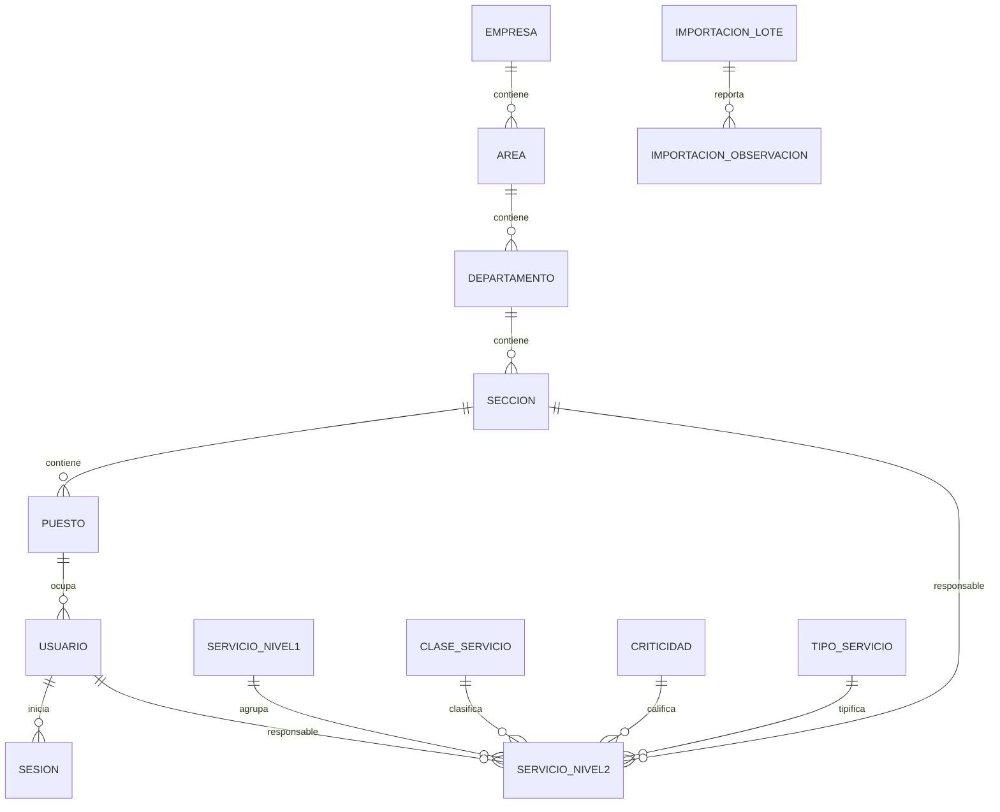

# Resolución técnica

## 1. Problema, alcance y supuestos

La solución reemplaza la consulta/mantenimiento manual del catálogo por una aplicación con autenticación local, organización, responsables, importación repetible y trazabilidad. No incluye tickets, facturación ni consumo. El Excel original llegó después de la primera implementación: el fixture sintético permitió desarrollar sin fabricar sus datos y la validación posterior contra el original descubrió y corrigió dos casos que el fixture inicial no cubría.

## 2. Arquitectura

Monolito FastAPI sirve API y UI, SQLAlchemy implementa el modelo, Alembic crea el esquema, PostgreSQL 16 persiste datos, openpyxl procesa combinaciones y pytest ejecuta controles. Dos contenedores reducen dependencias: `app` espera el healthcheck de `db`; PostgreSQL usa volumen nombrado. La UI server-hosted evita CORS y un pipeline de frontend innecesario.

## 3. Modelo

| Tabla | Clave y restricciones relevantes |
|---|---|
| empresa | PK `id`, `codigo` único, baja lógica |
| area/departamento/seccion/puesto | FK obligatoria al padre; `UNIQUE(parent_id,codigo)` |
| usuario | login único, hash Argon2id, rol limitado por CHECK, puesto opcional |
| sesion | hash SHA-256 de token único, expiración y revocación |
| servicio_nivel1 | código único, nombre, estado y origen |
| servicio_nivel2 | código único; FKs; todos los campos A:L; CHECK mínimo≤máximo; origen y revisión |
| clase/criticidad/tipo | código/nombre únicos y baja lógica |
| importacion_lote/observacion | SHA-256, resumen, hoja/fila/rango, original y canónico |

La empresa del usuario se deriva por puesto→sección→departamento→área; no se duplica. Un responsable usuario debe estar activo y pertenecer a la sección responsable.

## 4. Excel → base de datos

| Excel | Destino |
|---|---|
| A/B | `servicio_nivel1.codigo/nombre` |
| C/D | `servicio_nivel2.codigo/nombre` |
| E | `indicador_activo_excel` nullable; no se confunde con baja lógica |
| F/G/H | FKs clase/criticidad/tipo, nullable si desconocido |
| I/J/K/L | descripción, métrica, mínimo, máximo; ausencias son NULL |

El mapa de combinaciones resuelve cada celda solo hacia el ancla de su rango. Una fila con datos y sin código N2 fuera de esa regla se observa y omite. Los códigos se convierten a texto, nunca a número. Cada servicio guarda hoja/fila/rango y las anomalías guardan evidencia adicional.

Para `SE.12` se adopta `Suministrar Analitica`, primer nombre en fila 99, como canónico determinista; `Mantener Tableros de Control` se registra como valor alternativo. La fila 101 contiene `SE.12.3` pero A/B vacías fuera de una combinación: una regla limitada a fila 101 y ese código la vincula explícitamente a `SE.12`, dejando observación `padre_inferido_se12`. Las filas 99–101 conservan NULL y quedan `pendiente`. Un valor numérico ilegible o rango inválido se observa, no se convierte a cero. El lote calcula 12/46 sobre códigos vistos en esa carga, no sobre toda la tabla. En reimportación, valores idénticos cuentan como omitidos; nunca crean duplicados.

## 5. Seguridad

Login acepta usuario/correo y valida Argon2id. El navegador recibe un token aleatorio en cookie HttpOnly/SameSite=Strict; la base solo conserva su hash. Logout marca la sesión revocada, y cada petición comprueba expiración y usuario activo. Mutaciones administrativas exigen rol y token CSRF derivado con HMAC. En `APP_ENV=production`, la cookie usa `Secure` y debe servirse bajo HTTPS. Ninguna respuesta serializa `password_hash`.

## 6. Evidencia de ingeniería con IA

- Context engineering: [AGENTS.md](../AGENTS.md) y [actualizaciones](contexto/ACTUALIZACIONES.md).
- Prompt engineering: [cinco prompts e iteraciones](prompts/PROMPTS_USADOS.md).
- Harness engineering: [ciclo real fallo/corrección](evidencias/CICLO_HARNESS.md), scripts y tests.

## 7. Matriz de aceptación

| Requisito | Implementación | Prueba/evidencia |
|---|---|---|
| P01 | `/api/auth/login`, Argon2 | `test_p01_*` |
| P02 | dependencia de sesión + revocación/inactivo | `test_p02_*` |
| P03 | `require_admin` en servidor | `test_p03_*` |
| P04 | CRUD jerárquico y usuario | `test_p04_*` |
| P05 | constraints y mensajes 409/422 | `test_p05_*` |
| P06 | mapa de combinaciones + control 12/46 | original aprobado 12/46 + pruebas |
| P07 | upsert por código y comparación | segunda carga: 0 creados/0 actualizados |
| P08 | regla SE.12, NULL/revisión | consulta real y observaciones filas 100/101 |
| P09 | Pydantic + CHECK DB | `test_p09_*` |
| P10 | query, filtros, offset/limit | `test_p10_*` |
| P11 | validación usuario→puesto→sección | `test_p11_*` |
| P12 | volumen y restart | `scripts/test-persistence.ps1/.sh` |
| CRUD/roles | API y UI; bajas lógicas bloqueadas con dependencias | suite + revisión manual |
| Docker | build, migración, seed, healthchecks, volumen | `scripts/validate.*` |
| UI interactiva | pestañas, búsqueda, ficha y regreso | Playwright `tests/e2e/frontend.spec.js` |

P01–P11 son pruebas de integración HTTP aisladas con SQLite en memoria; las restricciones y consultas se ejecutan también en PostgreSQL al levantar Compose. P12 es una prueba de sistema contra PostgreSQL real. El E2E corre Chromium en un contenedor Playwright contra la aplicación real por la red de Compose.

## 8. Resultados reales

El 2026-10-01 se ejecutó dentro de Docker: primera corrida `8 failed, 2 passed, 1 skipped`; el error fue un import faltante de `timezone`. Tras corregirlo: `10 passed, 1 skipped` en 2.53 s. Después de las auditorías focalizadas: `11 passed, 1 skipped` en 3.46 s. Al llegar el Excel real, la primera carga falló por continuaciones de C combinada; corregida esa regla obtuvo 12/45 y reveló la excepción de fila 101. La suite final, ya con el original, obtuvo `13 passed` en 4.47 s. Desde un volumen limpio, la carga creó 12 N1 + 46 N2 (`creados=58`) y la repetición dio `creados=0`, `actualizados=0`, `nivel1=12`, `nivel2=46`. PostgreSQL respondió a salud/login y P12 confirmó persistencia. No se afirma un commit: el solicitante pidió no crear commits.

## 9. Docker, persistencia y recuperación

El flujo está en [README](../README.md). `docker compose down` conserva datos; `docker compose down -v` destruye el volumen y solo se usa para reiniciar pruebas. El entrypoint migra y hace seed idempotente antes de iniciar. Logs: `docker compose logs -f app db`. La fuente está montada como solo lectura.

