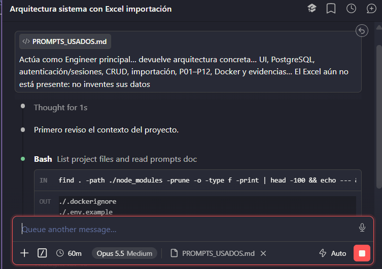
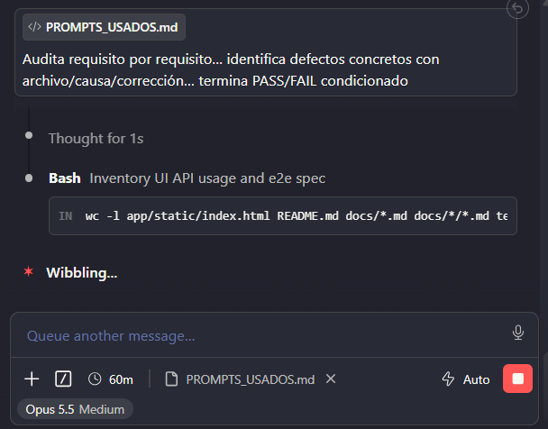
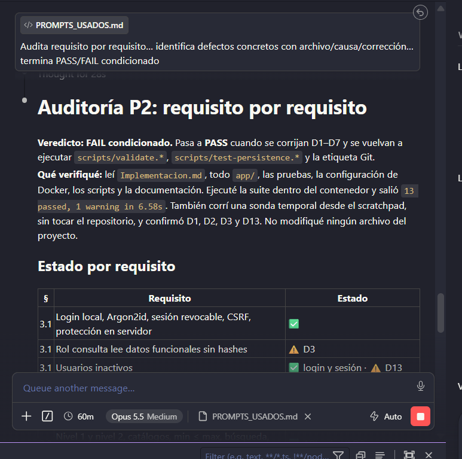
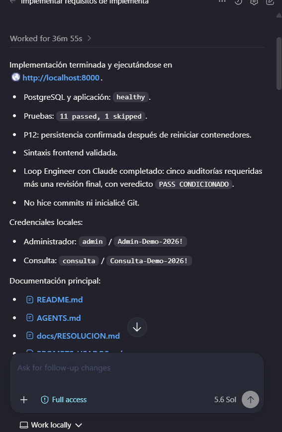
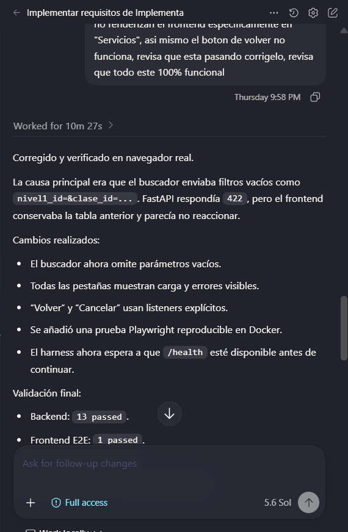

# Prompts utilizados con Claude Code

Herramienta: Claude Code.

## P1 — arquitectura inicial

- Objetivo: definir una arquitectura mínima completa.
- Contexto: `Implementacion.md` y directorio vacío.
- Instrucción usada: “Actúa como Engineer principal… devuelve arquitectura concreta… UI, PostgreSQL, autenticación/sesiones, CRUD, importación, P01–P12, Docker y evidencias… El Excel aún no está presente: no inventes sus datos”.
- Restricciones/salida: no editar; riesgos y lista priorizada.
- Aceptación: cubrir todos los dominios y reconocer honestamente la dependencia ausente.
- Resultado: FastAPI/PostgreSQL/Jinja/JS, sesiones revocables y fixture sintético. Aceptado.

## P2 — auditoría integral

- Objetivo: hallar brechas después de la primera implementación.
- Contexto: especificación, proyecto completo y corrida `10 passed, 1 skipped`.
- Instrucción usada: “Audita requisito por requisito… identifica defectos concretos con archivo/causa/corrección… termina PASS/FAIL condicionado”.
- Aceptación: hallazgos trazables, sin exigir datos ficticios.
- Resultado: detectó documentación, demo, UI, CSRF y trazabilidad. Se corrigieron los hallazgos técnicos; el Excel, entonces pendiente, llegó después y activó un ciclo adicional del harness. Git sigue pendiente por instrucción expresa.

## P3 — análisis del Excel/importador

- Objetivo: auditar las seis reglas reales de calidad.
- Contexto: especificación + `app/importer.py`.
- Instrucción usada: “Audita exclusivamente… celdas combinadas, idempotencia, SE.12, nulos, códigos texto, trazabilidad y conteos 12/46”.
- Salida/aceptación: máximo ocho hallazgos accionables.
- Resultado: se añadieron origen por servicio, conteos por conjunto leído, filas omitidas y comparación antes de marcar actualizado.

## P4 — autenticación

- Objetivo: revisar seguridad de login, sesión y roles.
- Contexto: especificación, seguridad, rutas y pruebas.
- Instrucción usada: “Audita exclusivamente autenticación/autorización: Argon2, sesiones, logout, inactivos, roles, CSRF y exposición de hashes”.
- Resultado: cookie Secure por entorno, comparación constante, manejo de hashes corruptos y pruebas CSRF/no exposición. Rate limiting se documentó como limitación, pues una solución local por proceso no sería robusta.

## P5 — Docker y pruebas

- Objetivo: validar reproducibilidad y P01–P12.
- Contexto: especificación, Dockerfile, Compose, scripts y tests.
- Instrucción usada: “Audita exclusivamente reproducibilidad Docker y cobertura P01–P12… falta el Excel original y no pidas inventarlo”.
- Resultado: P12 equivalente en Bash, `up --build`, healthcheck de app y aclaración de niveles de prueba.

## P6 — auditoría final del árbol de trabajo

- Ejecución: 2026-10-05; Claude Code CLI 2.1.276; modelo predeterminado no expuesto por el CLI.
- Objetivo: contrastar las correcciones finales con `Implementacion.md`, `AGENTS.md` y el diff sin modificar el repositorio.
- Contexto: repositorio completo y resultados `15 passed`, Playwright `1 passed`, importación 12/46 idempotente y P12 OK.
- Instrucción usada: “Audita en solo lectura este repositorio contra Implementacion.md y AGENTS.md. No leas .env, no edites ni hagas commits. Revisa especialmente el git diff actual… Lista solo brechas verificables restantes”.
- Restricciones/salida: máximo 500 palabras, brechas comprobables y veredictos técnico/Git separados.
- Aceptación: distinguir fallos funcionales de pendientes de entrega y no proponer alterar fechas Git.
- Resultado: veredicto técnico PASS condicionado; detectó que el flujo Bash dependía de bits ejecutables ausentes, que faltaba registrar la corrida final y que el commit/tag de entrega seguía pendiente. Se cambiaron las invocaciones a `sh`, se registró el resultado real y se mantuvo explícito el pendiente Git.

## Dos iteraciones de mejora comprobadas

1. P1 propuso la arquitectura, pero todavía no podía evaluar código. P2 añadió código y resultado real; descubrió brechas de UI/demo y originó correcciones concretas.
2. P2 señaló trazabilidad general. P3 redujo el contexto al importador y precisó que cada servicio normal carecía de origen y que “actualizado” era inexacto; el modelo/importador se corrigió y se reejecutaron pruebas.

